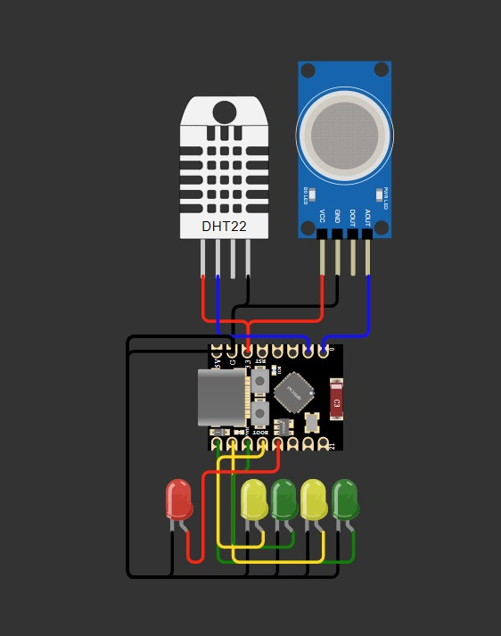

# SISTEM KONTROL LAMPU BERDASARKAN KEPEMILIKAN, MEMBACA SUHU RUANG, KELEMBAPAN, DAN PERINGATAN DINI AKAN KEBOCORAN GAS

Sistem Smart Home merupakan integrasi teknologi Internet of Things (IoT) yang memanfaatkan konektivitas nirkabel untuk menciptakan ekosistem rumah yang responsif. Melalui penggunaan mikrokontroler ESP32, sistem ini tidak hanya memungkinkan pengendalian lampu secara jarak jauh, tetapi juga mengimplementasikan pemantauan kondisi lingkungan secara real-time. Dengan integrasi sensor DHT22 untuk suhu dan sensor MQ untuk deteksi kebocoran gas, sistem ini bertransformasi dari sekadar alat kendali menjadi solusi otomasi yang meningkatkan efisiensi energi serta standar keamanan rumah modern.

Proyek Sederhana ini disusun oleh kelompok 6 yang terdiri dari;
- Ammar Nabil Fauzan (2309106006)
- Zhorif Fachdiat (2309106014)
- Adhitya Fajar Al-Huda (2309106027)
- Muhammad Ghazali (2309106041)

### Pembagian Tugas

Agar proyek sederhana ini berjalan lancar, kami melakukan pembagian tugas berdasarkan keahlian masing-masing anggota
- Ammar bertugas untuk mempersiapkan alat dan membuat bot telegram
- Zhorif merangkai alat agar berfungsi dengan baik
- Fajar melakukan uji testing integrasi bot dengan esp agar mengetahui apakah sudah berfungsi 
- Ghazali mengoding agar data yang diterima sensor DHT22 dan MQ bisa dibaca, sehingga sesuai dengan skenario kegunaan proyek dibuat.

Komponen yang digunakan pada proyek ini diantaranya;
1. 1 Esp32-Supermini-C3
2. 1 Sensor MQ
3. 1 sensor DHT22
4. 5 LED (Merah, Kuning, Hijau)
5. 1 Kabel USB to C
6. 14 Kabel jumper

### Board Schematics

  

